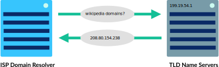

# ML-Journey
working with machine learning, let's **start learning from beginers**.

- [ML-Journey](#ml-journey)
  - [Week 1](#week-1)
    - [Day 1 ("Data Type")](#day-1-data-type)
    - [Day 2, 3 ("Data Type 2")](#day-2-3-data-type-2)
    - [Day 3 ("Internet")](#day-3-internet)
    - [Day 4, 5 ("Internet 2")](#day-4-5-internet-2)
    - [Day 6 ("Internet 3")](#day-6-internet-3)
    - [Day 7 ("Programming")](#day-7-programming)

> inspiration and guide line from this [YouTube](https://www.youtube.com/watch?v=MhCHrvfAXlc&list=PLBmyjHMDRyymkx738MhfZMBeE99DAA_R5&index=7 "YouTube").

## Week 1
### Day 1 ("Data Type")

* ***Binary Number***
    * A computer is electronic so the data that it can be work with are ether 0,1 tell this wire is on or off ```1 == on/0 == off```.
    * ***8 bits == 1 byte***
    * nowadays byte is smallest addressable unit in computer
    * how to detect odd number in binary ? => **Ans** look at last bit at once's position ```(value == 0) ? False : True```

* ***Integer Number***
    * overflow

* ***Floating Number***
    * roundoff

> [!NOTE]
> Learned Vocabulary :book:
> - aspirants => ผู้พูด
> - exorbitant => สูงเกินไป
> - sufficient => เพียงพอ

[08/04/2024]: #

---

### Day 2, 3 ("Data Type 2")

* ***Text***
  * __ASCII__
    * use 7 bits size
    * the first 32 charactors of ASCII is control charactors
  * __Unicode__
  * __UTF-8__
    * start with bit 0 represent ASCII charactors. **look for _single bytes_ to get charactor**
      * A --> 01000001
    * start with bits 110 represent Latin, Arabic, Greek, etc. **look for _two bytes_ to get charactor**
      * α --> 11001110 10110001
    * start with bits 1110 represent Asian charactors. **look for _three bytes_ to get charactor**
      * ก --> 11100000 10111000 10000001
    * start with bits 11110 represent other charactors. else **look for _four bytes_ to get charactor**
      * 🐳 --> 11110000 10011111 10010000 10110011

* ***Analog Data*** --> data wich have contiuously sequence of data ( eg. sound )
  * __Sampling__ --> reduce precision and continuously of data in X-axis
    * sample rate / sampling interval
  
  * __Quantization__ --> reduce precision and continuously of data in Y-axis
    * quantization interval
  * __Binary Encoding__
    * bit depth --> how many bit use encrypt each sample
  * __Reconstruction__ --> convert digital data back to wave

| Original                                           |                      Sampling                      |                        Quantization                        |                            Binary                             | Reconstruction                                              |
| :------------------------------------------------- | :------------------------------------------------: | :--------------------------------------------------------: | :-----------------------------------------------------------: | :---------------------------------------------------------- |
|  |  |  |  |  |

* ***Compression Data***
  * __Lossless__ --> reduce size file with out losing any information ( work with ``text document, simple image, binary data`` )
    * _Text document_ **eg.** "to be or not to be, that is the question" -->> "⊜ ⬗ or not ⊜ ⬗, ⟡at is ⟡e question" which replace ``"to" -->> ⊜``, ``"be" -->> ⬗``, ``"th" -->> ⟡``
    * _Simple image_ using **run-length encoding (RLE)** to reduce same pattern of color pixel **eg.** ``--====---====---`` - binary -> ``0011110001111000`` - RLE -> ``2, 4, 3, 4, 3``
      * > [!TIP] RLE can't be use in image which have different colors
    * _Binary data_ using **Huffman coding**
  * __Lossy__ --> reduce size file by discard less important information ( work with ``photos, audio, videos`` )
    * _Images_ kept only data of brightness and color wich reduce value of color
      * <div></div>
    *  _Audio_ analyze and discard data wich human can't hear that data
*  ***Ethic***
   * Copyright
   * Fair use
   * Creative Commons
   * Open source
   * Public domain
   * Online publish
     * [Google Scholar](https://scholar.google.com/)
   * Open databases

> [!NOTE]
> Learned Vocabulary :book:
> - telegraphy => โทรเลข
> - telepriters => เครื่องพิมพ์ดีด
> - alternative => ทางเลือก
> - precise => แม่นยำ
> - irreversible => กลับไม่ได้
> - intellectual => ทางปัญญา
> - doctrine => หลักคำสอน

[09/04/2024]: #
[10/04/2024]: #

---

### Day 3 ("Internet")

* ***Words***
  * __Internet__ --> network able devices communicate with other.
  * __Protocol__ --> rule how can device communicated.
  * __Wires & Wireless__ --> connection between devices/protocol for converted eletromagnetic to binary data.
  * __IP__ --> unquely identify address be destination to send data to.
  * __TCP/UDP__ --> protocol that can transfer data and detect error along the way.
  * __TLS__ --> secure protocol sending encrypted data.
  * __HTTP & DNS__ --> protocol for World Wide Web.
  * __Computer Network__ --> grop of computering devices that interconnected with other
  * __Computering Device__ --> any device that can run a program
  * __Network Topology__ --> way computering device connected 
  * __Router__ --> device moved paket along
  * __IP Header__ --> meta data of IP
* ***Type of network***
  * __Local area Network "LAN"__ --> cover limited area eg. house, school
  * __Wild Area Network "WAN"__ --> cover large area extended many, many LANs
  * __Data Center Network "DCN"__ --> used in data center where data must exchanged with very little delay
* ***Physical connection***
  * __Copper cables__ --> transmit pulse of **electricity** that represent binary data 
  * __Fiber-optic cables__ --> sending pulse of **light** that represent binary data ( can transfer data more than copper) 
  * __Wireless__ --> converted binary data to **radio wave** and transmit through the air 
* ***Transferation***
  * binary data transfer by 
  * __Bit rate__ --> number of bits data send for a second
  * __Bandwidth__ --> maximum bit rate of system
  * __Latency__ --> period of time sending data from computering device to other ( have milliseconds as unit ) also know as ping rate
  * __Internet speed__ --> combination of bandwidth and latency

> [!NOTE]
> Learned Vocabulary :book:
> - acronym => ตัวย่อ
> - knit => ถัก/ผสาน
> - opt => เลือก
> - congestion => ความแออัด

[10/04/2024]: #

---

### Day 4, 5 ("Internet 2")

* ***Internet Protocol "IP"***
  * protocol that using in all internet connetion handle addressing and routing
  * __IP Address__ uniquely identify internet connected device
    * __IPv4 Address (Octets)__ have 4 digit of **octal<sub>8</sub>** stored IP address (but not enough)
      * eg. 74.125.20.113 --> 74<sub>8</sub> . 125<sub>8</sub> . 20<sub>8</sub> . 113<sub>8</sub>
    * __IPv6 Address__ have 4 * 8 digit of **hexadecimal<sub>16</sub>** stored IP address
      * eg. FFFF:FFFF:FFFF:FFFF:FFFF:FFFF:FFFF:FFFF ( each F is F<sub>16</sub> )
  * __IP Packets__ is way how to split and transfer data
* ***Internet routing protocol***
  * 1. __send packet to router__ --> send paket to nearest router
  * 2. __router recive packet__ --> look up for destination ip address in ip header
  * 3. __route packet forward__ --> the router have a **forwarding table** wich stored prefixes of ip address, once it most specific to the destination ip address router will send packet along the path
  * 4. __route forwards message__
* ***Redundancy*** --> available path route to the destination ip address
* ***Fault tolerance*** --> usable when some path route borken
* ***Problem in IP***
  * __multiple messages__ --> destination need to identify which packet belong to which messages
  * __out of order__ --> each packet from message follow difference path to the destination
  * __corrupt__ --> for some reason, the receiver can't match the received with originally data
  * __lost__ --> packet of message may lost, it may lead to can't put the message back together
  * __duplicate__ --> packet may accidently retransmission
  * 
  * have **Transmission Control Protocol "TCP"** a transport protocol that use on top IP include ordering, retransmission, data integrity use for solve these problem and **User Datagram Protocol "UDP"** solve fewer problem but offer faster data trasport than TCP
* ***User Datagram Protocol "UDP"*** --> light weight data transfer protocol, worked on top IP
  * solve only corrupt data.
  * sometimes known as the **Unreliable Data Protocol**
  * use in application required speed more accuracy
  * __Packet format__ 
    * UDP segment header contain 8 bytes
    * __Port number__ --> use 4 bytes help distinguish difference type of network traffic
    * __Segment length__ --> use 2 bytes to tell length of segment ( including the header )
    * __Checksum__ --> check data corruption
* ***Transmission Control Protocol "TCP"*** --> transport protocol ensure reliable transmission of packet, worked on top IP
  * solve all the problem
  * use mostly on top IP know as **TCP/IP**
  * __Packet format__ 
    * TCP header contain 20 - 60 bytes
    * how to transmitting a packet using TCP
      * 1. __Establish connection__ --> SYN = "synchronize", ACK = "acknowlege"  finsh all these ready to transmitting data! ( these transmitting dosen't include any data )
      * 2. __Send packegs of Data__  first device send data, the seconde device send back ack bit + length of data
      * 3. __Close the connection__ --> FIN = "finish"  sending back and forth these packet to disconnected
    * __Detecting lost packets__ --> using timeout, after send packet but didn't get ack bit then it will send the packet again ( may lead to duplicated data ) 
    * __Handling out of order packets__ --> recipient can order the packets by the sequence number 
* ***Web Protocol*** loads web page which on top by
  * __Domain Name System "DNS" Protocol__ --> convert domain name ( Uniform Resource Locator "URL" ) to IP address
  * __HyperText Transfer Protocol "HTTP"__ --> request webpages' contents from IP address
  * __Transport Layer Security "TLS" Protocol__ --> secure the website by encrypted connection
* ***Domain Name System "DNS"*** --> human-friendly IP address for websit
  * __Anatomy__ --> [third-level-domain].[second-level-domain].[top-level-domain]
    * __top level domains "TLDs"__ eg. ``.com``, ``.org``, ``.edu``
    * __second level domain__ is unique company or organization eg. ``wikipedia``, ``khanacademy``
    * __third level domain (subdomain)__ lead to subset of website eg. ``m.wikipedia.org`` (mobile-optimized Wikipedia), ``es.khanacademy.org`` (Spanish-language Khan Academy)
  * __Converted URLs to IP address__
    * 1. __check local cache__ --> map url with browser cache
    * 2. __check ISP cache__ --> ISP ( Internet Service Provider ) provide domain name resolving service and keep it own cache
    * 3. __ask name server__ </br>    
* ***Hypertext Transfer Protocol*** --> use to download page from another computer
  * HTTP build on top of TCP/IP
  * 1. __Direct browser to URL__
  * 2. __Lookup for IP__ --> using DNS to get IP
  * 3. __Browser send HTTP request__ </br> ``GET /index.html HTTP/1.1`` </br> ``Host: www.example.com``
    * Get --> command
    * /index.html --> content of the websit
    * HTTP/1.1 --> version of protocol
    * the second line --> domain url
  * 4. __Host send back HTTP response__ </br> ``HTTP/1.1 200 OK``
    * protocol + version
    * status code
* ***Scalable***
* ***Suit Protocol*** </br> 


> [!NOTE]
> Learned Vocabulary :book:
> - anticipate => คาดหวัง
> - redundancy => ความซ้ำซ้อน
> - meaget => ขาดแคลน
> - consequence => ผลที่ตามมา
> - distinguish => แยกแยะ
> - bureaucratic => ระบบราชการ
> - threaten => คุกคาม
> - onslaught => การโจมตี
> - buckle => คาดคะเน
> - vastly => อย่างมากมาย
> - amidst => ท่ามกลาง
> - frustrate => หงุดหงิด
> - accommodate => รองรับ
> - conduct => ดำเนินการ

[11/04/2024]: #
[12/04/2024]: #

---

### Day 6 ("Internet 3")

* ***open protocol development***
* talk about computer divide

> [!NOTE]
> Learned Vocabulary :book:
> - socioeconomic => เศรษฐกิจ + สังคม
> - demographic => ข้อมูลประชากร
> - infrastructure => โครงสร้างพื้นฐาน
> - venture => กิจการ

[13/04/2024]: #
[I had skipped this class, bored]: #

---

### Day 7 ("Programming")

* ***Logic Equivalent***
  * NOT A AND NOT B ≡ NOT (A OR B)
  * NOT (A AND B) ≡ NOT A OR NOT B

* ***World***
  * __statement__ --> A line of code ( instruction )

> [!TIP]
> - ~ --> Alt + Numpad(126)

> [!NOTE]
> Learned Vocabulary :book:
> - drawback => ข้อเสียเปรียบ
> - puddle => บ่อ
> - yarn => เส้นด้าย